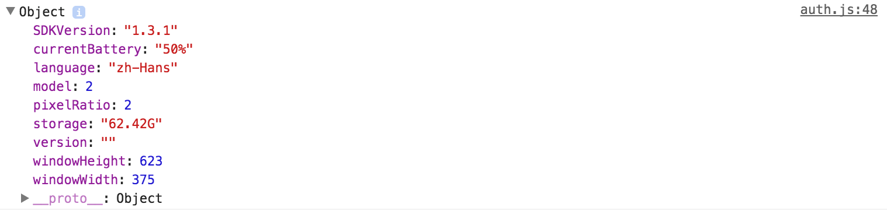

## my.getSystemInfoSync
> [my.getSystemInfoSync][mygetsysteminfosync]同步方法 在项目初始化时调用报错。

1. 在页面生命周期函数（onLaunch、onShow、onHide、onError）中调用此方法。
2. 使用异步方法[my.getSystemInfo][mygetSystemInfo]获取所需信息。

!> 注意：在模拟器中获取的数据参数和真机上获取参数不同，可能会导致模拟器中`system` `platform`等参数获取不到; `my.getStorageSync({ key: 'key' })` 获取的数据是一个对象 obj，通过 obj.data 获取到数据， 此处和微信小程序有所不同。

真机getSystemInfoSync()数据


模拟器getSystemInfoSync()数据


!> 项目中封装有**`my.systemInfo`**的方式获取设备信息。如果需要获取高度请直接使用 `getSystemInfoSync().windowHeight`， 不要使用`my.systemInfo.windowHeight`方式，原因:`my.systemInfo`获取的信息会被缓存，后面获取会从缓存中读取，而缓存的高度信息是在首页获取到的高度不包含首页底部导航条的高度，这里需要注意。

设置高度、宽度过程如果有需要rpx转px计算可调用**`my.Util.rpx2px(num)`**方法


## scroll-view

!> `scroll-view`组件没有**`hidden`**属性，类似的组件还有**`swiper`**

> 样式 height:100% 无效

使用竖向滚动时，需要给一个固定高度，通过 acss 设置 height。通过[my.getSystemInfoSync][mygetsysteminfosync]或[my.getSystemInfo][mygetSystemInfo]获取windowHeight设置高度.

!> 设置高度、宽度过程如果有需要rpx转px计算可调用`my.Util.rpx2px(num)`方法


> 使用 scroll-into-view 滚动异常

尝试删除`scroll-with-animation`属性

> 回到顶部设置 scrollTop 为0无效.

尝试将 scrollTop 设置为1
```js
bindGotop() { //回至顶部
  this.setData({
    scrollTop: this.data.scrollTop ? 0 : 1
  });
}
```

[mygetsysteminfosync]: https://docs.alipay.com/mini/api/system-info#mygetsysteminfosync
[mygetSystemInfo]: https://docs.alipay.com/mini/api/system-info#mygetsysteminfo


## swiper

> swiper-item 上不能绑定各种点击事件

绑定事件无效，需要在内部包一层元素, swiper-item样式设置`height: 100%`无效,需要指定具体值。
```axml
<swiper class="swiper-box" indicator-dots="{{indicatorDots}}">
  <block a:for="{{boxes}}">
    <swiper-item>
      <view class="swiper-item swiper-item-{{item.color}}" onTap="swiperItemTapHandle">
        {{item.color}}
      </view>
    </swiper-item>
  </block>
</swiper>
```


## 网络请求

> 网络请求方法 `my.httpRequest` ，返回状态码字段为 status，请求头字段为 headers

调用时需注意

> `my.fetch`中的data参数，内部有对象的，需要先通过`JSON.stringify`进行转换，原因是支付宝在传递参数时，会将其转换为`[object Object]`而不是JSON字符串

调用时需注意

> 真机查看时IOS端闪退问题

可能是由于请求头设置的VersionCode设置为了数字，修改为字符串即可，header = { VersionCode: 66 } => header = { VersionCode: '66' }


> 请求header的 Content-Type设置注意大小写

标准写法
```
{
	"Content-Type": "text/html"
}
```


## 方法调用

> `getCurrentPages` 方法返回的路由的当前页面key是 route 而不是 route [page||app].json

调用时需注意

> 图片上传 `my.uploadFile` 参数中需要添加 headers 头信息

同时需要注意用户选择图片时返回值与微信不同,[微信参考][wxUplaodImage] [支付宝参考][alipayUplaodImage]

[wxUplaodImage]: https://mp.weixin.qq.com/debug/wxadoc/dev/api/media-picture.html#wxchooseimageobject
[alipayUplaodImage]: https://docs.alipay.com/mini/api/media-image#mychooseimage

> 注意 es6对象方法简写方法可能隐藏的坑

es6中提供[箭头函数][arrowFunction], 由于在箭头函数中不绑定自己的`this`，所以在使用过程中需要注意以免遇坑。
实际场景：

其中 `success` 方法调用的方式属于Page页面对象的`this`，而 `(){ } `方式定义的方法中 `this` 取决于方法调用的对象。在此上下文中`success`方法执行，获取到的`this`为`undefined`，因此后面方法的执行会出错导致收货问题的bug.

推荐阅读：
1. [箭头函数](https://developer.mozilla.org/zh-CN/docs/Web/JavaScript/Reference/Functions/Arrow_functions)
2. [关于es6语法简写](https://segmentfault.com/q/1010000007426883?_ea=1341764)
3. [什么时候“不要”用箭头函数](http://www.zcfy.cc/article/when-not-to-use-arrow-functions-482.html)


[arrowFunction]: https://developer.mozilla.org/zh-CN/docs/Web/JavaScript/Reference/Functions/Arrow_functions


## 样式类

> input等标签默认样式和微信默认样式不一样

需要重置


> 动画效果在scroll-view上会失效

提出来包裹一层将动画效果放在外层


## 其他

> transform初始值为{}导致报错

tranform=null


> 对于在axml中使用需要使用到的数据需要在 data初始化否则可能会报错 很多es6的对象(例如Array.prototype.fill()、Array.prototype.find()、Symbol等)不支持

及时提出，统一引入相关pollyfill处理

## a:for
> 当前使用`a:for`循环的元素上`a:if`不能使用变量。

会导致页整个元素不显示，解决方式在循环体内部使用`a:if`或者`a:for`用在`<block>`元素上。

【推荐写法】:在支付宝小程序中`a:for`推荐作用在`<block>`上，需要循环的元素放在block内部。
```axml
<swiper indicator-dots="{{indicatorDots}}" autoplay="{{autoplay}}">
  <block a:for="{{background}}">
    <swiper-item>
      <view class="swiper-item bc_{{item}}"></view>
    </swiper-item>
  </block>
</swiper>
```

## `<block/>`

注意： `<block/>` 并不是一个组件，仅仅是一个包装元素，不会在页面中做任何渲染，**只接受控制属性**。


